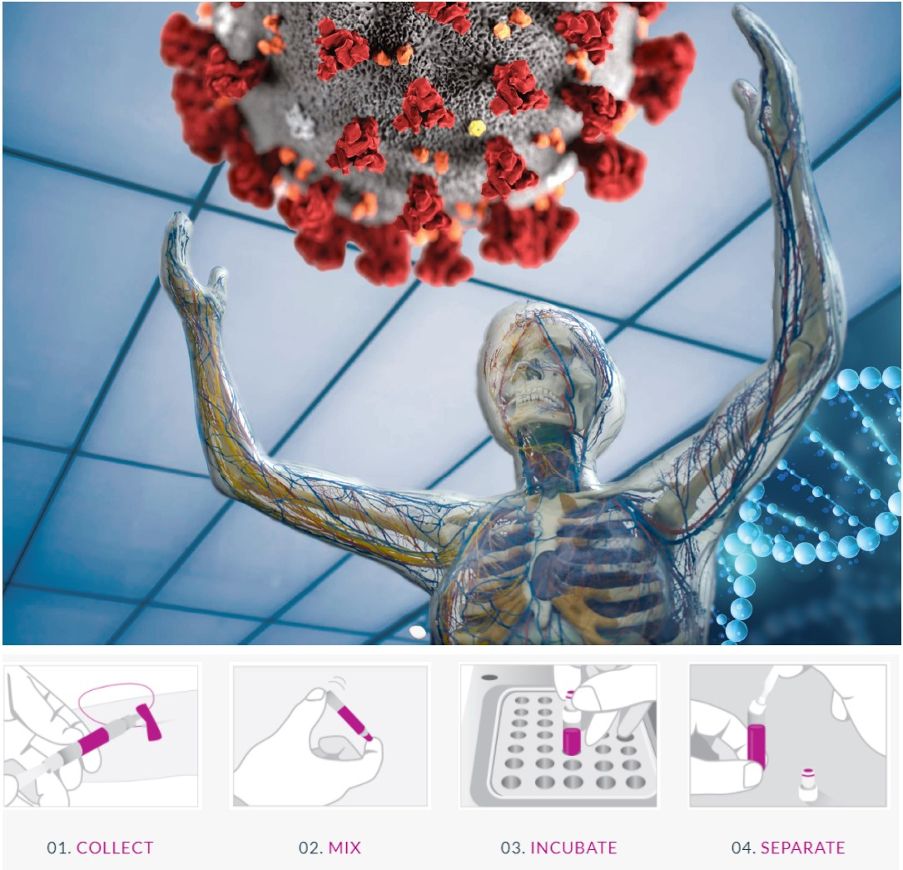

<p align="center"></p>

This repository contains the MAIDS description for project U21-01. It was built by cloning the [MAIDS-Template](https://github.com/PERSIMUNE/MAIDS-Template). You will find more details about this dataset below with links to visit the website and download the PDF.

>MAIDS is currently being prototyped for the [Copenhagen Ultrathon on Precision Medicine](https://ultrathon.online) where you will find more information about the event. You may also be interested in viewing other examples listed in the 2021 Ultrathon [Project Pool](https://github.com/UltrathonOnline/U21-PROJECT-POOL).

There are several ways to stay informed:
* Visit the Ultrathon's [landing page](https://ultrathon.online) and sign up to the mailing list.
* Follow us on [Twitter](https://twitter.com/UltrathonOnline).
* Watch the repository for changes.

---

### **U21-04**: Predicting the immune response to SARS-CoV-2 in the COVIMUN cohort, a study of host genetics and cytokine response profiles in the context of known immunological pathways
<p align="center"></p>

>Visit the [website](https://ultrathononline.github.io/MAIDS.U21-04.COVIMUN/) for this dataset or download the formatted [PDF](./docs/maids.pdf).
```
Rebecka Svanberg, Carsten Niemann, Sisse Ostrowski, Rasmus Lykke Marvig, Preston Yui Sum Leung
>@: Rigshospitalet, Copenhagen, Denmark

The sudden emergence of a global pandemic with a new pathogen, SARS-CoV-2, created an instant need to
understand the immunologic reactions arising in response to infection with this pathogen,as well as
understanding the underlying patient-specific factors determining the circumstances within which these
immune reactions occur. As a result, the current dataset was created, combining whole genome sequencing
with consecutive extensive characterization of patient immune cell composition and phenotypes together
with in vitro functional assessment of stimulated whole blood immune responses. The current dataset
provides a unique opportunity to unravel correlations between genotype and immune phenotype- and function
in response to COVID-19, which could ultimately have significant clinical impact.
```


